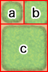

# UnityScriptLab - Tiles

Collection of Scripted Tiles.

## Terrain Auto Tile

Autotile using the format from RPG Maker VX and onwards.

### Tile Texture Structure

- a) Single Tile (Boundaries on all sides)
- b) Corners (Boundaries on each corner only)
- c) Group Pattern (Area of tiles)

### How To Use

1) Create Asset with "Create > Tiles > Terrain Autotile
2) Set a Base Texture with the structure above
